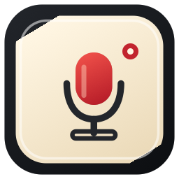

# Hot Mic — by Kinekt



**For the record.**

Hot Mic is a native macOS dictation app that streams microphone audio to the ElevenLabs Scribe v2 Realtime API and copies finalized text to the clipboard. It is a regular Dock and Cmd-Tab app with a menu-bar control and a floating recording bar.

> Hot Mic is source software. This repository does not currently provide a GitHub Release or a downloadable installer. Build it yourself or package it as described below.

## Features

- Configurable global, single-press shortcut; the initial suggested shortcut is Control–Option–Space when available.
- Native SwiftUI/AppKit settings and a non-focus-stealing recording bar.
- Direct realtime transcription with live provisional text and finalized copied results.
- Pause, continue, reset, and finish-and-close controls.
- English, Dutch, or automatic language selection plus optional vocabulary hints.
- API key stored only in the macOS Keychain; no plaintext fallback.
- No app-created audio files, transcript logs, backend, analytics, or automatic paste.

## Requirements

- macOS 14 or later.
- Full Xcode with Swift 6 for building from source.
- An ElevenLabs account, API key with speech-to-text access, and available credit for dictation.
- A microphone and macOS microphone permission.

The Xcode target and scheme are named `Dictation`; the product is **Hot Mic.app**. Release packaging builds universal `arm64` and `x86_64` binaries.

## Build and run

Open `Dictation.xcodeproj` in Xcode, or build from the repository root:
```sh
git clone https://github.com/dick-kinekt/hot-mic.git
cd hot-mic
```


```sh
xcodebuild -project Dictation.xcodeproj -scheme Dictation \
  -configuration Debug -destination 'platform=macOS' \
  -derivedDataPath .build build
open '.build/Build/Products/Debug/Hot Mic.app'
```

Hot Mic opens its settings window at launch. Closing that window does not quit the app, disable the shortcut, stop an active recording, or clear the current result. Reopen it from the Dock, the menu-bar **Settings…** item, or Command–Comma. Quitting stops capture and discards uncopied in-memory text.

## Set up dictation

1. In ElevenLabs, create an API key with speech-to-text access and ensure the account has credit. See [ElevenLabs API authentication](https://elevenlabs.io/docs/api-reference/authentication).
2. In **General → Connection**, enter the key in the secure field and select **Save Key**. The key is stored in macOS Keychain under service `local.Dictation.elevenlabs` and account `api-key`; replacing or removing it updates that item. The draft field is cleared after saving or leaving settings.
3. Allow microphone access when prompted. If access was denied, enable **Hot Mic** in **System Settings → Privacy & Security → Microphone**.
4. In **Privacy**, read the provider guidance and acknowledge it. In **Speech**, choose Automatic, English, or Dutch, and optionally add vocabulary hints (one per line; at most 50, each 20 characters or fewer).
5. Set a recording shortcut in **General**. A cleared shortcut remains disabled across relaunches.

Never put an API key in source, a shell command, a `.env` file, an issue, or a chat message.

## Recording controls

The shortcut is **single press**, not hold-to-talk:

1. Press it once to start a new dictation and show the floating bar. Press it again while the bar is visible to cancel and dismiss the dictation. This discards current text, stops pending finalization, and leaves the clipboard unchanged.
2. Select **Pause** to turn the microphone off and finalize the current stream. On success, Hot Mic copies the complete accumulated dictation to the clipboard.
3. Select **Continue** to add another recording segment to the same dictation. The next pause copies all accumulated text, not only the new segment.
4. Select **Reset** (the arrow button) to discard current text, stop pending finalization, clear the timer, and leave the bar paused and ready for a fresh continuation. The clipboard is unchanged.
5. Select **Close** while recording to finalize and copy before dismissing. Closing an already copied paused dictation dismisses it. If finalization or copying fails, the bar remains open with recovery actions to copy the available text or open settings.

The preview follows live provisional text and can be expanded to review the current dictation. Finalized text—not a provisional hypothesis—is copied. The recording bar does not activate Hot Mic or take focus from the destination app. Hot Mic does not paste text, send Return, or restore focus after copying.
Expanded review follows new text only while you are at the bottom. Scroll up to
read without being pulled back down; **Latest** resumes following. Collapse
returns to the latest two lines. Language, vocabulary and privacy choices persist
between launches; **Session** shows only the current dictation, not saved history.


## Privacy, provider data, and charges

Microphone capture runs only while recording. Audio is sent directly to ElevenLabs;
already-buffered audio can finish sending after capture stops, during finalization.
Hot Mic has no backend and does not create audio files or transcript logs. It does
not log API keys, authorization headers, raw audio, WebSocket payloads, or transcripts.

Dictation uses the account holder's ElevenLabs API access and can incur ElevenLabs charges, including additional cost for keyterm prompting. Review the provider's terms, pricing, and data practices before use.

Before real use, turn off **Terms and privacy → Data use → Improve the models for everyone** in your ElevenLabs account. That training opt-out applies to future submissions; it is **not** zero retention, and Hot Mic cannot verify or change the account setting.

The **Request zero retention** setting sends `enable_logging=false`. It is intended for eligible enterprise accounts. If ElevenLabs rejects the request, dictation fails rather than silently falling back to ordinary retention. When the setting is off, ordinary provider retention applies. Provider eligibility and account configuration are outside Hot Mic's control.

Copied text is placed on the system clipboard. Clipboard managers, sync services, and other apps may retain it.

Useful provider references:

- [Realtime speech-to-text API](https://elevenlabs.io/docs/api-reference/speech-to-text/v-1-speech-to-text-realtime)
- [Realtime transcripts and commit strategies](https://elevenlabs.io/docs/eleven-api/guides/how-to/speech-to-text/realtime/transcripts-and-commit-strategies.md)
- [Model-training opt-out](https://elevenlabs.io/docs/help-center/legal/is-my-data-used-to-improve-eleven-labs-ai-models.md)
- [Zero retention mode](https://elevenlabs.io/docs/eleven-api/resources/zero-retention-mode.md)

## Troubleshooting
### Xcode command-line tools are selected instead of Xcode

For build/check commands, set
`DEVELOPER_DIR=/Applications/Xcode.app/Contents/Developer` in that command's
environment (adjust if Xcode is installed elsewhere). This selects full Xcode
without changing your global developer-tool settings.

### macOS asks for Keychain access again

Local builds use ad-hoc signing. Rebuilding or changing the installation location
can require renewed Keychain or microphone authorization. Approve prompts only
in macOS; never share your key or login password in an issue.


### Microphone access is unavailable

Use **General → Microphone → Allow Microphone**. If macOS previously denied the request, enable Hot Mic in **System Settings → Privacy & Security → Microphone**, then return to the app and try again.

### A shortcut does not work

Choose a different shortcut in **General**. Hot Mic checks known system and application-menu conflicts for the default suggestion, but macOS or another app may still reserve a shortcut. A cleared shortcut disables global recording until you choose one again.

### The app cannot begin dictation

Confirm all of the following: privacy guidance is acknowledged, vocabulary hints meet their limits, a Keychain API key is saved, microphone access is allowed, and the ElevenLabs account can use speech-to-text. Authentication, quota, rate-limit, policy, network, and provider errors are shown in the app.

### Copying failed

Keep the recording bar open and use its **Copy** action, or open **Session** in settings to select and copy the current text manually. Do not assume the clipboard changed after a failed copy.

## Known limitations

Hot Mic is deliberately a copy-only dictation workflow. It currently has no:

- Automatic paste, Return-key synthesis, or focus restoration.
- Durable transcript history; uncopied in-memory text is lost on quit or when a new dictation replaces it.
- Raycast integration or Raycast history.
- Launch-at-login support.

Physical global-shortcut presses and every sleep, input-device, and provider-account condition depend on the local macOS and ElevenLabs environment.

## Package a DMG

Packaging is for macOS and requires full Xcode, Python 3.10 or later, and the system tools used by `scripts/build_dmg.py`. Create an isolated virtual environment, install the package-only dependencies, then run the packaging script:

```sh
python3 -m venv --copies .build/dmg-tools
.build/dmg-tools/bin/python -m pip install -r scripts/dmg-requirements.txt
.build/dmg-tools/bin/python scripts/build_dmg.py
```

With no `--app` argument, the script builds a universal Release app and writes `dist/Hot-Mic-<version>.dmg`. It uses standard operating-system temporary storage by default. To choose the parent directory for temporary staging, pass `--work-dir`; a relative path resolves from the repository root and a missing directory is created:

```sh
.build/dmg-tools/bin/python scripts/build_dmg.py --work-dir /path/to/writable-temporary-parent
```

To package an existing app instead of building one, pass `--app`:

```sh
.build/dmg-tools/bin/python scripts/build_dmg.py --app '/path/to/Hot Mic.app'
```

The default package is ad-hoc signed for local testing and is **not notarized**. Do not represent it as a notarized or frictionless public download. For Developer ID distribution, provide your own signing identity and existing notarytool Keychain profile:

```sh
.build/dmg-tools/bin/python scripts/build_dmg.py \
  --signing-identity 'Developer ID Application: Your Name (TEAMID)' \
  --notary-profile YOUR_NOTARY_PROFILE
```

`--notary-profile` requires `--signing-identity`. No signing identity, account credential, or notary profile is included in this repository.
To install a locally built DMG, open it, drag **Hot Mic** onto **Applications**,
eject the image, and open the app from Applications. Quit any development copy
before opening the installed one. Each user supplies their own ElevenLabs key.

The original app icon and installer artwork can be regenerated with:

```sh
xcrun swift scripts/generate_brand_assets.swift
```


## Focused checks

The retained checks use synthetic audio, a local loopback fixture, fakes, or a private test pasteboard. They do not call ElevenLabs, use the app API key, or open the microphone. Run the smallest relevant check for a change.

The realtime transport regression requires Xcode and Bun:

```sh
python3 scripts/verify_realtime.py
```

The audio-capture smoke check:

```sh
mkdir -p .build/verification
xcrun swiftc -swift-version 6 -warnings-as-errors -parse-as-library \
  Dictation/AudioCapture.swift Tests/AudioCaptureSmoke.swift \
  -o .build/verification/audio-capture-smoke
.build/verification/audio-capture-smoke
```

The recording-workflow smoke check:

```sh
mkdir -p .build/verification
ARCH="$(uname -m)"
xcrun swiftc -target "$ARCH-apple-macosx14.0" -swift-version 6 \
  -warnings-as-errors -strict-concurrency=complete -parse-as-library \
  -framework AppKit -framework AVFoundation -framework Security \
  Dictation/AudioCapture.swift Dictation/CredentialStore.swift \
  Dictation/DictationSettings.swift Dictation/RealtimeClient.swift \
  Dictation/TranscriptionCoordinator.swift Tests/RecordingWorkflowSmoke.swift \
  -o .build/verification/recording-workflow-smoke
.build/verification/recording-workflow-smoke
```

The shortcut smoke check requires a Debug build first so the pinned KeyboardShortcuts product is available:

```sh
mkdir -p .build/verification
ARCH="$(uname -m)"
xcrun swiftc -target "$ARCH-apple-macosx14.0" -swift-version 6 \
  -warnings-as-errors -strict-concurrency=complete -parse-as-library \
  -I .build/Build/Products/Debug \
  Dictation/RecordingShortcutController.swift Tests/RecordingShortcutSmoke.swift \
  .build/Build/Products/Debug/KeyboardShortcuts.o \
  -o .build/verification/recording-shortcut-smoke
PACKAGE_RESOURCE_BUNDLE_PATH="$PWD/.build/Build/Products/Debug" \
  .build/verification/recording-shortcut-smoke
```

## Repository map

- `Dictation/` — application source and app icon catalog: capture, realtime client, Keychain storage, shortcut, settings, and recording UI.
- `Dictation.xcodeproj/` — Xcode project and Swift Package resolution.
- `Resources/` — app metadata, entitlements, and DMG artwork.
- `Tests/` — focused smoke programs and the local realtime fixture.
- `scripts/` — DMG packaging and focused verification helpers.
- [`CHANGELOG.md`](CHANGELOG.md) — public version history.
- [`THIRD_PARTY_NOTICES.md`](THIRD_PARTY_NOTICES.md) — third-party software notices.

## Contributing and license

See [CONTRIBUTING.md](CONTRIBUTING.md) for development and contribution guidance and [SECURITY.md](SECURITY.md) for vulnerability reporting.

Hot Mic is licensed under the [MIT License](LICENSE). Third-party software is identified in [THIRD_PARTY_NOTICES.md](THIRD_PARTY_NOTICES.md).